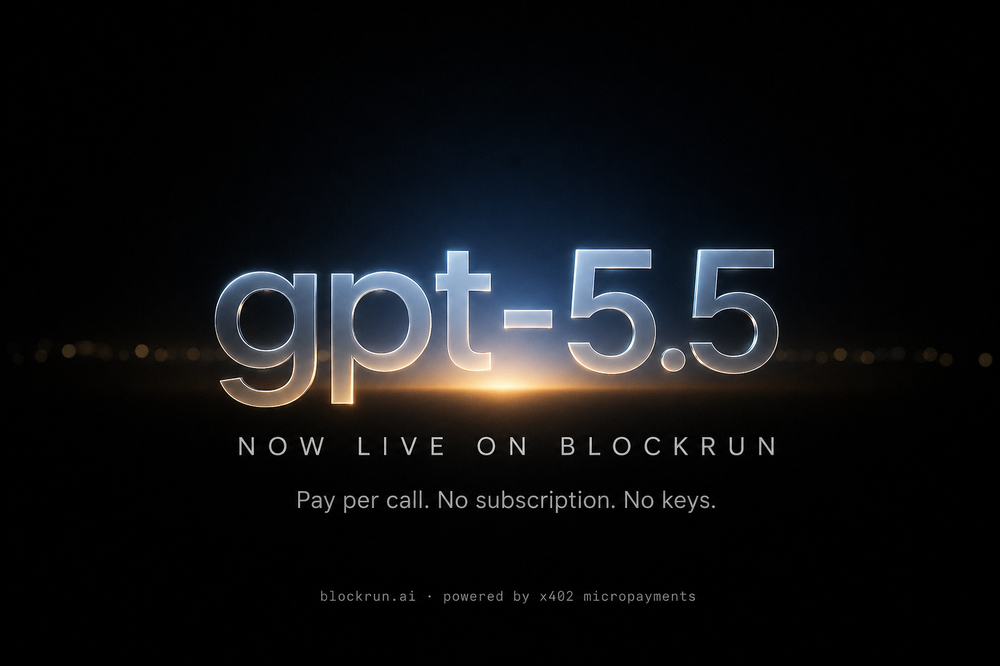
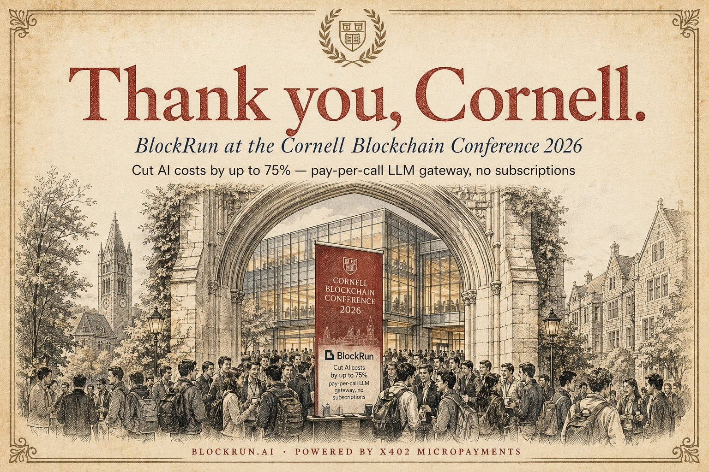
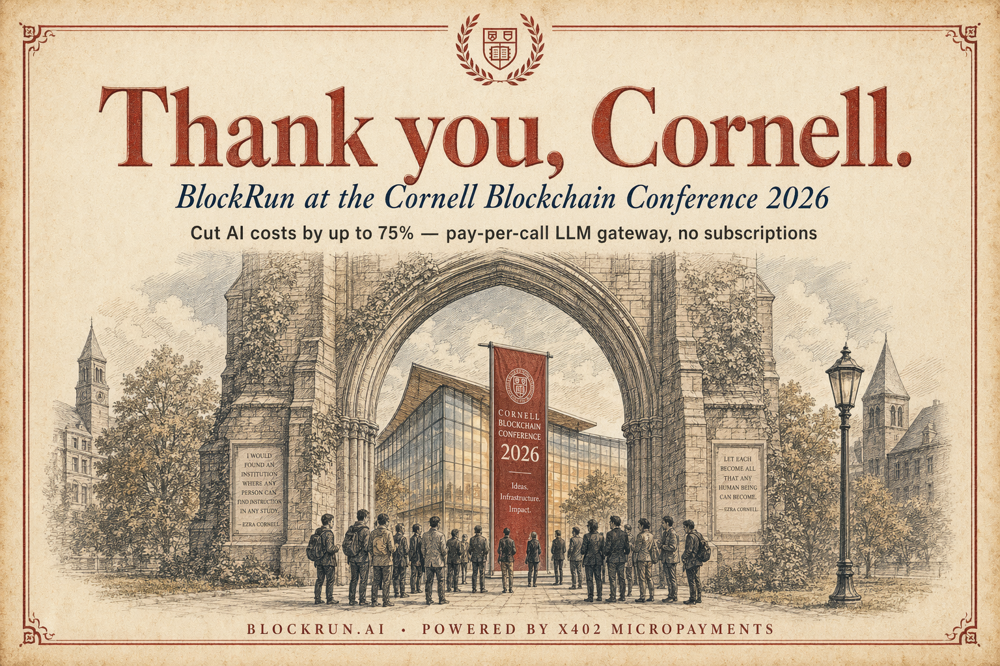
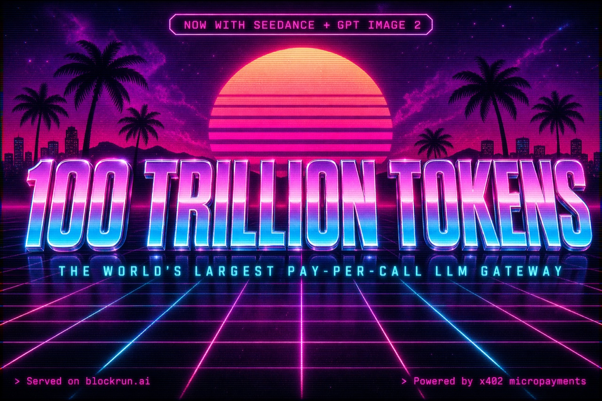

# BlockRun MCP

[](https://www.npmjs.com/package/@blockrun/mcp)
[](LICENSE)
[](https://modelcontextprotocol.io)

**Real-time data for Claude — markets, research, X/Twitter, crypto. No API keys. Pay per call.**

```bash
claude mcp add blockrun -s user -- npx -y @blockrun/mcp@latest
```

Wallet auto-created. Fund with $5 USDC. Ask Claude anything.

---

## What changes

Before BlockRun, Claude can't answer:

- *"What's the current Polymarket probability that Bitcoin hits $100k this year?"*
- *"Find me the top 5 papers on RAG published in the last 30 days"*
- *"What are people saying about @sama on X right now?"*
- *"What's the 24h volume on the PEPE/ETH pair on Uniswap?"*

After BlockRun, it can. Each query costs fractions of a cent, billed from a local USDC wallet. No subscriptions. No API dashboards. No key rotation.

---

## Demo

> **User:** What's Polymarket saying about the Fed rate decision next month?

> **Claude:** According to Polymarket, the market currently puts a **73% probability** on the Fed holding rates steady at the May meeting, with 24% on a 25bp cut and 3% on a hike. Volume over the last 24h: $2.1M. The "Hold" contract last traded at $0.73.
>
> *(via `blockrun_markets` · cost: $0.001)*

---

> **User:** Find recent papers on speculative decoding and summarize the key approaches

> **Claude:** I found 8 papers from the last 60 days via neural search. The dominant approaches are: (1) draft model selection — smaller models predicting N tokens ahead for the larger model to verify in parallel...
>
> *(via `blockrun_exa` · cost: $0.01)*

---

## Showcase

Posters generated through `blockrun_image` with `openai/gpt-image-2`. Each is a single API call routed through BlockRun, paid in USDC on Base.

### Latest — GPT-5.5 now live on BlockRun

<p align="center">
  
</p>

### Gallery

| | | |
|:---:|:---:|:---:|
|  |  |  |
| **Cornell Blockchain Conference 2026** — packed booth recap | **Cornell Blockchain Conference 2026** — quiet variant | **100 Trillion Tokens** — milestone synthwave poster |

Prompts and a worked example for these are in [`skills/image-prompting/SKILL.md`](skills/image-prompting/SKILL.md).

---

## Install

**Claude Code (recommended)**
```bash
claude mcp add blockrun -s user -- npx -y @blockrun/mcp@latest
```

The `-s user` flag installs globally (available in every project). The `--` separator
ensures `-y` is passed to `npx`, not parsed by `claude mcp add`.

**Claude Desktop** — add to `claude_desktop_config.json`:
```json
{
  "mcpServers": {
    "blockrun": {
      "command": "npx",
      "args": ["-y", "@blockrun/mcp"]
    }
  }
}
```

**Hosted (no install, always latest)**
```bash
claude mcp add blockrun -s user --transport http https://mcp.blockrun.ai/mcp
```

---

## Fund your wallet

Run `blockrun_wallet` to see your address. Send USDC on Base.

| Method | Steps |
|--------|-------|
| Coinbase | Send → USDC → Base network → paste address |
| Bridge from Ethereum | [bridge.base.org](https://bridge.base.org) |

$5 covers ~5,000 market queries, ~500 Exa searches, ~250 image generations, or ~30 Seedance 1.5-pro clips (5s).

---

## Tools

| Tool | Data source | Cost |
|------|-------------|------|
| `blockrun_chat` | 55+ LLMs (GPT, Claude, Gemini, DeepSeek, Kimi K2.6, GLM, NVIDIA free tier, ...) with `mode` tier routing | per token |
| `blockrun_image` | DALL-E 3, GPT Image 1/2, Grok Imagine, Flux, CogView-4, Nano Banana — generation + editing | $0.015–0.12 |
| `blockrun_video` | xAI Grok Imagine Video + ByteDance Seedance 1.5/2.0/2.0-fast | $0.03–0.30/sec |
| `blockrun_music` | MiniMax music generation | per track |
| `blockrun_price` | Pyth-backed realtime + OHLC — crypto / FX / commodity (free), 12 stock markets (paid) | free or $0.001/call |
| `blockrun_markets` | Polymarket, Kalshi, dFlow, Binance Futures | $0.001/query |
| `blockrun_x` | X/Twitter — profiles, tweets, followers, mentions, search (AttentionVC) | per call |
| `blockrun_exa` | Neural web search (Exa) — research, competitors, papers, URL content | $0.01/query |
| `blockrun_search` | Grok Live Search — web + news with citations | ~$0.025 per source |
| `blockrun_dex` | Live DEX prices via DexScreener | free |
| `blockrun_models` | Live catalogue of every LLM/image/video/music model + pricing | free |
| `blockrun_wallet` | Balance, spending, agent budgets, setup QR | free |

---

## Why not just use the APIs directly?

| | Direct APIs | BlockRun |
|---|---|---|
| Exa | Sign up, $20/mo minimum | $0.01/call, no subscription |
| Polymarket | Undocumented, rate-limited | $0.001/call, clean JSON |
| Twitter/X API | $100–$5000/month | $0.03/page, no approval |
| Multiple sources | 4 accounts, 4 API keys, 4 billing pages | 1 wallet |

One wallet. All sources. No dashboards.

---

## Multi-agent budget delegation

Delegate a spending budget to a child agent with `agent_id`. The child is auto-blocked when the budget runs out — useful for autonomous agents that shouldn't run up unbounded costs.

---

## How it works

Pay-per-call via [x402](https://x402.org) micropayments in USDC on Base. Your wallet lives at `~/.blockrun/.session`. Private key never leaves your machine.

---

[blockrun.ai](https://blockrun.ai) · [npm](https://www.npmjs.com/package/@blockrun/mcp) · [@BlockRunAI](https://x.com/BlockRunAI)
